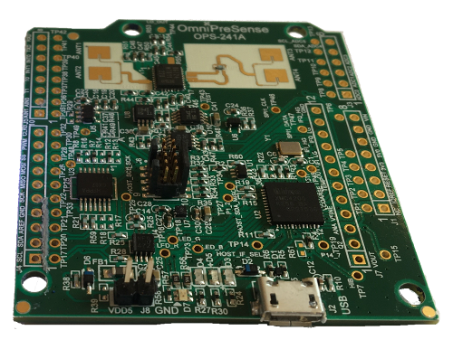

# OmniPreSense OPS241 Radar driver (Version 0.0.2)



A library and tool to configure and use the OmniPreSense OPS241 Radar unit.

The OPS241-A is complete short-range radar sensor providing motion detection, speed, and direction reporting.
All radar signal processing is done on board and a simple API reports the processed data. Flexible control
over the reporting format, sample rate, and module power levels is provided.

This tool makes use of the API to configure the radar unit and to display dataflow from it.

# Library usage

This library provides `OPS241Radar` class:

``` python
from ops241.radar import OPS241Radar

with OPS241Radar() as radar:
    print(radar.get_module_information())
    while True:
        data = radar.read()
        if len(data) > 0:
            print(data)

```


## ops241-radar usage

```zsh
$ ops241
Usage: ops241 [OPTIONS] COMMAND [ARGS]...

  OPS241 Radar

Options:
  --version                    Show the version and exit.
  -p, --port TEXT              TTY Port radar is available at  [default: /dev/ttyACM0]
  -j, --json-format / --plain  JSON Output format  [default: True]
  -m, --metric TEXT            Use metric units  [default: True]
  --help                       Show this message and exit.

Commands:
  api    List available API commands
  ports  List available com ports
  watch  Watch data stream from radar
```

### api commands

```zsh
$ ops241 commands
GET_BOARD_UID
GET_CONFIG
GET_DATA_PRESISION0
GET_FIRMWARE_BUILD_NUMBER
GET_FIRMWARE_VERSION_NUMBER
GET_MODULE_INFORMATION
GET_PART_NUMBER
GET_QUERY_TIME
GET_RESET_REASON
GET_SPEED_UNITS
GET_TX_FREQUENCY
GET_UART_BAUD_RATE
RESET_CLOCK
RESET_CONFIG
SET_BUFFER_SIZE_1024
SET_BUFFER_SIZE_256
SET_BUFFER_SIZE_512
SET_CONFIG
SET_DATA_PRECISION0
SET_DATA_PRECISION1
SET_DATA_PRECISION2
SET_DATA_PRECISION3
SET_DATA_PRECISION4
SET_DATA_PRECISION5
SET_DUTY_CYCLE
SET_DUTY_CYCLE_0
SET_DUTY_CYCLE_10
SET_DUTY_CYCLE_100
SET_DUTY_CYCLE_1S
SET_DUTY_CYCLE_200S
SET_DUTY_CYCLE_50
SET_DUTY_CYCLE_5S
SET_DUTY_CYCLE_NORMAL
SET_MAGNITUDE_HIGH
SET_MAGNITUDE_LOW
SET_MAGNITUDE_LOW_NO_LIMIT
SET_MOTION_INTERRUPT_OFF
SET_MOTION_INTERRUPT_ON
SET_OUTPUT_FFT_OFF
SET_OUTPUT_FFT_ON
SET_OUTPUT_JSON_OFF
SET_OUTPUT_JSON_ON
SET_OUTPUT_LED_OFF
SET_OUTPUT_LED_ON
SET_OUTPUT_MAGNITUDE_OFF
SET_OUTPUT_MAGNITUDE_ON
SET_OUTPUT_RAW_ADC_OFF
SET_OUTPUT_RAW_ADC_ON
SET_OUTPUT_REPORT_NUMBER
SET_OUTPUT_SPEED_REPORT_OFF
SET_OUTPUT_SPEED_REPORT_ON
SET_OUTPUT_TIME_OFF
SET_OUTPUT_TIME_ON
SET_OUTPUT_ZERO_BLANK_LINES
SET_OUTPUT_ZERO_BLANK_OFF
SET_OUTPUT_ZERO_BLANK_ON
SET_POWER_MODE_0
SET_POWER_MODE_1
SET_POWER_MODE_2
SET_POWER_MODE_3
SET_POWER_MODE_4
SET_POWER_MODE_5
SET_POWER_MODE_6
SET_POWER_MODE_7
SET_POWER_MODE_ACTIVE
SET_POWER_MODE_IDLE
SET_POWER_MODE_MAX
SET_POWER_MODE_MID
SET_POWER_MODE_MIN
SET_POWER_MODE_SINGLE_SHOT
SET_POWER_MODE_SYSTEM_RESET
SET_POWER_MODE_TX_OFF
SET_RED_LED_OFF
SET_RED_LED_ON
SET_SAMPLE_RATE_100K_PER_SECOND
SET_SAMPLE_RATE_10K_PER_SECOND
SET_SAMPLE_RATE_1K_PER_SECOND
SET_SAMPLE_RATE_20K_PER_SECOND
SET_SAMPLE_RATE_50K_PER_SECOND
SET_SAMPLE_RATE_5K_PER_SECOND
SET_SPEED_REPORT_CLEAR_DIRECTION_CONTROL
SET_SPEED_REPORT_INBOUND_DIRECTION_ONLY
SET_SPEED_REPORT_MAXIMUM
SET_SPEED_REPORT_MINIMUM
SET_SPEED_REPORT_OUTBOUND_DIRECTION_ONLY
SET_SPEED_UNITS_CM_PER_SECOND
SET_SPEED_UNITS_FEET_PER_SECOND
SET_SPEED_UNITS_KM_PER_HOUR
SET_SPEED_UNITS_METERS_PER_SECOND
SET_SPEED_UNITS_MILES_PER_HOUR
SET_SQUELCH_100
SET_SQUELCH_1000
SET_SQUELCH_10000
SET_SQUELCH_20000
SET_SQUELCH_30000
SET_SQUELCH_40000
SET_SQUELCH_500
SET_SQUELCH_5000
SET_SQUELCH_50000
SET_SQUELCH_60000
SET_SQUELCH_HIGH
SET_SQUELCH_HIGH_NO_LIMIT
SET_SQUELCH_LOW
SET_SQUELCH_LOW_NO_LIMIT
SET_SQUELCH_n
SET_TX_FREQUENCY
SET_UART_BAUD_RATE_115200
SET_UART_BAUD_RATE_19200
SET_UART_BAUD_RATE_230400
SET_UART_BAUD_RATE_57600
SET_UART_BAUD_RATE_9600
SET_YELLOW_LED_OFF
SET_YELLOW_LED_ON

```

### watch

```zsh
$ ops241 watch
{"OutputFeature":"J"}
{"OutputFeature":"M"}
{"Product":"OPS241"}
{"Version":"1.3.0"}
{"SamplingRate":5000, "resolution":0.0995}
{"SampleSize":1024}
{"Clock":"88648"}
{"Q2COUNT":"1150 (~23000 counts/sec) @t=88648"}
{"PowerMode":"Continuous"}
{"Squelch":"1000"}
{"RequiredMinSpeed":"0.000"}
{"magnitude":"467.72","speed":"-0.25","distance":"0.00"}
{"magnitude":"362.44","speed":"-0.35","distance":"0.00"}
{"magnitude":"166.39","speed":"-1.44","distance":"0.00"}
{"magnitude":"170.31","speed":"-1.24","distance":"0.00"}
{"magnitude":"165.46","speed":"-1.44","distance":"0.00"}
{"magnitude":"117.24","speed":"-0.45","distance":"0.00"}
{"magnitude":"130.33","speed":"-1.44","distance":"0.00"}
{"magnitude":"78.59","speed":"-0.55","distance":"0.00"}
{"magnitude":"139.40","speed":"-1.05","distance":"0.00"}
{"magnitude":"118.74","speed":"0.45","distance":"0.00"}
{"magnitude":"161.28","speed":"-0.25","distance":"0.00"}
{"magnitude":"108.46","speed":"-0.65","distance":"0.00"}
{"magnitude":"418.98","speed":"-0.85","distance":"0.00"}
```


## Install

`ops241` is available in pypi:

```
$ pip install ops241-radar
```


## Manual Install

Clone this repo and do

```
$ pip install .
```
